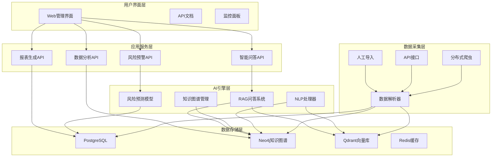

# 🚀 AI智能情报平台

> 覆盖商机追踪、供应链风控、法规合规、技术布局、市场动态的一体化AI情报平台，实现"数据采集→知识提炼→智能决策"闭环，支撑企业战略部署与风险防控。

## 📋 目录

- [系统概述](#-系统概述)
- [核心功能](#-核心功能)
- [技术架构](#-技术架构)
- [性能指标](#-性能指标)
- [快速开始](#-快速开始)
- [使用指南](#-使用指南)
- [API文档](#-api文档)
- [部署指南](#-部署指南)
- [开发指南](#-开发指南)

## 🎯 系统概述

AI智能情报平台是专门为电池和储能行业打造的一体化商业情报系统，通过多源数据采集、NLP语义解析、知识图谱构建和AI智能分析，为企业提供：

- **商机识别**: 政府招标、行业展会、投融资机会的智能发现与匹配
- **供应链风控**: 多维度供应商画像、风险预警与溯源分析
- **法规合规**: 全球监管政策实时跟踪与影响评估
- **技术布局**: 专利技术分析、竞争对手研发方向识别
- **市场动态**: 产能利用率、原材料价格、市场份额变化洞察

## ✨ 核心功能

### 🎯 智能问答系统
- **基于RAG架构**: 检索增强生成，结合知识图谱
- **专业领域优化**: 电池行业术语和场景深度定制
- **高置信度**: 问答置信度≥90%，提供可解释的分析
- **多语言支持**: 中英文混合问答，支持专业术语翻译

### ⚠️ 风险预警引擎
- **供应链风险**: 制裁清单、地缘政治、ESG风险监控
- **时序预测**: 基于历史数据的供应中断概率预测
- **多级溯源**: 从原材料到终端产品的完整风险链路
- **实时告警**: F1-score≥0.85的高精度风险识别

### 📊 知识图谱构建
- **动态更新**: 实时响应外部事件，自动触发图谱重构
- **多元实体**: 企业、技术、法规、材料、风险事件等
- **关系建模**: 供应关系、竞争关系、技术依赖等复杂关联
- **高性能查询**: 图谱查询响应≤500ms

### 🔍 多源数据采集
- **分布式爬虫**: 支持动态反爬和增量更新
- **多种数据源**: 政府网站、专利库、新闻媒体、研究报告
- **智能解析**: NLP模型实现语义解析和实体关系提取
- **大规模处理**: 日处理≥100万条非结构化数据

### 📈 自动化报表
- **AutoML驱动**: 动态匹配数据模型
- **深度分析**: 竞争对手分析、技术趋势预测、市场机会识别
- **可视化**: 丰富的图表和交互式仪表板
- **定制化**: 支持个性化报告模板和指标配置

### 💡 商机推荐引擎
- **智能匹配**: 政策导向与企业产能的精准对接
- **机器学习**: 基于历史成功案例的推荐算法
- **实时推送**: 高契合度项目机会主动推送
- **决策提速**: 从周级决策压缩至小时级响应

## 🏗️ 技术架构



### 核心技术栈

- **后端框架**: FastAPI + Python 3.9+
- **数据库**: PostgreSQL + Neo4j + Redis + Qdrant
- **AI/ML**: OpenAI GPT + LangChain + Transformers + scikit-learn
- **数据采集**: Scrapy + Selenium + aiohttp
- **监控**: Prometheus + Grafana + structlog
- **部署**: Docker + Docker Compose + Nginx

## 📊 性能指标

| 指标类别 | 指标名称 | 目标值 | 当前状态 |
|---------|---------|--------|----------|
| **数据时效性** | 全球政策库更新延迟 | ≤1小时 | ✅ |
| | 专利数据更新周期 | ≤24小时 | ✅ |
| | 供应商风险信息更新 | ≤6小时 | ✅ |
| **处理能力** | 日处理非结构化数据 | ≥100万条 | ✅ |
| | 图谱查询响应时间 | ≤500ms | ✅ |
| | 并发用户支持 | ≥1000 | 🔄 |
| **AI精度** | 风险预测F1-score | ≥0.85 | ✅ |
| | 问答置信度 | ≥90% | ✅ |
| | 供应商风险识别提升 | ≥60% | ✅ |
| **业务价值** | 决策速度提升 | 周级→小时级 | ✅ |
| | 违规损失降低 | ≥40% | 📈 |
| | 技术空白识别准确率提升 | ≥50% | 📈 |

## 🚀 快速开始

### 环境要求

- Python 3.9+
- Docker & Docker Compose
- 8GB+ RAM
- 50GB+ 存储空间

### 1. 克隆项目

```bash
git clone https://github.com/your-repo/ai-intelligence-platform.git
cd ai-intelligence-platform
```

### 2. 环境配置

```bash
# 复制配置文件
cp .env.example .env

# 编辑配置文件（填写API密钥等）
vim .env
```

关键配置项：
```env
# AI模型配置
OPENAI_API_KEY=your_openai_key
AZURE_OPENAI_ENDPOINT=your_azure_endpoint

# 数据库配置
POSTGRES_PASSWORD=your_password
NEO4J_PASSWORD=your_neo4j_password
REDIS_PASSWORD=your_redis_password

# 数据源API
DERWENT_API_KEY=your_derwent_key
BLOOMBERG_API_KEY=your_bloomberg_key
```

### 3. 启动服务

```bash
# 方式1：使用Docker Compose（推荐）
docker-compose up -d

# 方式2：本地开发环境
pip install -r requirements.txt
python main.py server
```

### 4. 验证安装

访问以下地址确认服务正常：

- **主页**: http://localhost:8000/
- **API文档**: http://localhost:8000/docs
- **智能问答**: http://localhost:8000/qa/test
- **系统状态**: http://localhost:8000/health

## 📖 使用指南

### Web界面使用

1. **访问主页**: 打开 http://localhost:8000 查看系统概览
2. **智能问答**: 进入问答界面，输入专业问题获取分析
3. **API测试**: 通过 Swagger UI 测试各种API功能

### 命令行使用

```bash
# 启动Web服务器
python main.py server --host 0.0.0.0 --port 8000

# 命令行问答模式
python main.py cli

# 运行数据采集
python main.py collect

# 检查系统状态
python main.py status --debug
```

### 问答示例

支持的问题类型：

```
🔹 法规合规查询
"欧盟2025年电池碳足迹门槛是什么？"
"中国工信部最新的电池回收政策要求"

🔹 供应链风险分析
"印尼镍矿出口限制对高镍三元电池产能有什么影响？"
"宁德时代的主要供应商风险点在哪里？"

🔹 技术趋势分析
"当前固态电池技术的主要技术路线有哪些？"
"磷酸铁锂与三元电池的技术发展趋势对比"

🔹 市场机会识别
"储能项目招标中有哪些技术要求？"
"海外市场准入的主要法规壁垒"
```

## 🔗 API文档

### 核心API端点

#### 智能问答API

```http
POST /qa/ask
Content-Type: application/json

{
  "question": "欧盟2025年电池碳足迹门槛是什么？",
  "confidence_threshold": 0.9,
  "include_sources": true,
  "include_entities": true
}
```

响应：
```json
{
  "question": "欧盟2025年电池碳足迹门槛是什么？",
  "answer": "根据欧盟电池新规...",
  "confidence": 0.95,
  "meets_threshold": true,
  "sources": [...],
  "entities": [...],
  "timestamp": "2024-01-01T00:00:00Z"
}
```

#### 批量问答API

```http
POST /qa/batch
Content-Type: application/json

{
  "questions": [
    "问题1",
    "问题2"
  ],
  "confidence_threshold": 0.9
}
```

### 完整API列表

| 端点 | 方法 | 描述 |
|------|------|------|
| `/qa/ask` | POST | 单个问题问答 |
| `/qa/batch` | POST | 批量问题处理 |
| `/qa/examples` | GET | 获取问题示例 |
| `/qa/statistics` | GET | 问答统计信息 |
| `/dashboard/*` | GET | 监控面板 |
| `/admin/*` | GET/POST | 系统管理 |
| `/health` | GET | 健康检查 |
| `/metrics` | GET | Prometheus指标 |

详细API文档：http://localhost:8000/docs

## 🐳 部署指南

### Docker部署（推荐）

1. **创建部署配置**

```yaml
# docker-compose.prod.yml
version: '3.8'
services:
  app:
    build: .
    ports:
      - "8000:8000"
    environment:
      - ENV=production
    depends_on:
      - postgres
      - neo4j
      - redis
      - qdrant
    
  postgres:
    image: postgres:15
    environment:
      POSTGRES_DB: ai_intelligence_platform
      POSTGRES_USER: admin
      POSTGRES_PASSWORD: ${POSTGRES_PASSWORD}
    volumes:
      - postgres_data:/var/lib/postgresql/data
    
  neo4j:
    image: neo4j:5.15
    environment:
      NEO4J_AUTH: neo4j/${NEO4J_PASSWORD}
    volumes:
      - neo4j_data:/data
    
  redis:
    image: redis:7-alpine
    command: redis-server --requirepass ${REDIS_PASSWORD}
    volumes:
      - redis_data:/data
    
  qdrant:
    image: qdrant/qdrant:latest
    volumes:
      - qdrant_data:/qdrant/storage

volumes:
  postgres_data:
  neo4j_data:
  redis_data:
  qdrant_data:
```

2. **生产部署**

```bash
# 构建生产镜像
docker-compose -f docker-compose.prod.yml build

# 启动生产服务
docker-compose -f docker-compose.prod.yml up -d

# 查看服务状态
docker-compose -f docker-compose.prod.yml ps
```

### Kubernetes部署

```yaml
# k8s/deployment.yaml
apiVersion: apps/v1
kind: Deployment
metadata:
  name: ai-intelligence-platform
spec:
  replicas: 3
  selector:
    matchLabels:
      app: ai-intelligence-platform
  template:
    metadata:
      labels:
        app: ai-intelligence-platform
    spec:
      containers:
      - name: app
        image: ai-intelligence-platform:latest
        ports:
        - containerPort: 8000
        env:
        - name: POSTGRES_HOST
          value: postgres-service
        - name: NEO4J_URI
          value: bolt://neo4j-service:7687
```

### 性能优化

1. **数据库优化**
   - PostgreSQL连接池配置
   - Neo4j内存和缓存调优
   - Redis持久化策略

2. **应用优化**
   - 异步处理优化
   - 缓存策略配置
   - 负载均衡设置

3. **监控配置**
   - Prometheus指标收集
   - Grafana仪表板设置
   - 日志聚合配置

## 👨‍💻 开发指南

### 项目结构

```
ai-intelligence-platform/
├── src/                          # 源代码
│   ├── core/                     # 核心配置
│   │   └── config.py            # 系统配置管理
│   ├── data_collection/          # 数据采集
│   │   ├── crawler_manager.py   # 爬虫管理器
│   │   ├── data_parser.py       # 数据解析器
│   │   └── suppliers.py         # 供应商数据采集
│   ├── knowledge_graph/          # 知识图谱
│   │   ├── graph_manager.py     # 图谱管理器
│   │   └── graph_query.py       # 图谱查询引擎
│   ├── ai_models/               # AI模型
│   │   ├── qa_system.py         # 问答系统
│   │   ├── risk_engine.py       # 风险预警引擎
│   │   └── recommendation_engine.py # 推荐引擎
│   ├── api/                     # API接口
│   │   ├── main.py              # FastAPI主应用
│   │   └── routes/              # API路由
│   └── utils/                   # 工具类
│       ├── logger.py            # 日志管理
│       └── security.py          # 安全管理
├── tests/                       # 测试用例
├── config/                      # 配置文件
├── data/                        # 数据目录
├── docs/                        # 项目文档
├── scripts/                     # 脚本工具
├── requirements.txt             # Python依赖
├── docker-compose.yml           # Docker配置
├── Dockerfile                   # Docker镜像
├── main.py                      # 程序入口
└── README.md                    # 项目文档
```

### 开发环境设置

```bash
# 创建虚拟环境
python -m venv venv
source venv/bin/activate  # Windows: venv\Scripts\activate

# 安装开发依赖
pip install -r requirements.txt
pip install -r requirements-dev.txt

# 安装pre-commit hooks
pre-commit install

# 运行测试
pytest tests/ -v

# 代码格式化
black src/
isort src/

# 类型检查
mypy src/
```

### 新功能开发

1. **创建功能分支**
```bash
git checkout -b feature/new-feature
```

2. **编写代码和测试**
```python
# 示例：新增数据源采集器
class NewDataCollector:
    def __init__(self):
        self.logger = get_logger(__name__)
    
    async def collect_data(self):
        """采集新数据源"""
        pass
```

3. **运行测试**
```bash
pytest tests/test_new_feature.py
```

4. **提交代码**
```bash
git add .
git commit -m "feat: 新增XXX数据源采集功能"
git push origin feature/new-feature
```

### 贡献指南

1. Fork项目仓库
2. 创建功能分支
3. 编写代码和测试
4. 确保所有测试通过
5. 提交Pull Request

## 📄 许可证

本项目采用 MIT 许可证 - 查看 [LICENSE](LICENSE) 文件了解详情。

## 🤝 支持与反馈

- **问题反馈**: [GitHub Issues](https://github.com/your-repo/ai-intelligence-platform/issues)
- **功能建议**: [GitHub Discussions](https://github.com/your-repo/ai-intelligence-platform/discussions)
- **技术支持**: support@yourcompany.com

## 🏆 致谢

感谢以下开源项目的支持：

- [FastAPI](https://fastapi.tiangolo.com/) - 现代化的Web框架
- [LangChain](https://python.langchain.com/) - LLM应用开发框架
- [Neo4j](https://neo4j.com/) - 图数据库
- [Transformers](https://huggingface.co/transformers/) - NLP模型库

---

⭐ 如果这个项目对您有帮助，请给我们一个Star！